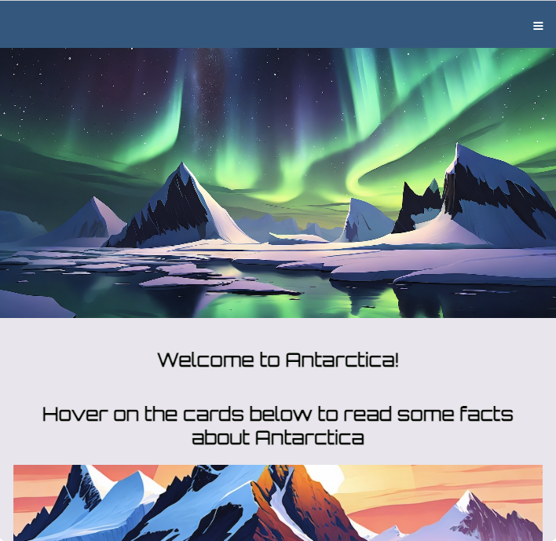

## Introduction

### New to the Raspberry Pi Editor?

Check out the [getting started guide](https://projects.raspberrypi.org/en/projects/getting-started-guide-editor-html){:target="_blank"}.

In this project, you will use HTML, CSS, and JavaScript to create a website that lets people discover a place they may never get a chance to visit — Antarctica. 

As well as the homepage, the website will have pages about Antarctica's wildlife and climate. 

**JavaScript** is a programming language that runs in your browser. As of 2024, it is the most popular programming language in the world!

You will:
+ Create an awesome modern website
+ Build a navigation bar (navbar)
+ Set accessible colours and fonts
+ Add some 'hero' images
+ Use a grid layout
+ Place items in a grid
+ Make elements responsive

--- no-print ---

--- task ---

### Try it

Explore the Welcome to Antarctica website.

What happens when you...
+ Click the hamburger icon (☰)?
+ Hover over the images?
+ Use the links to access the different pages?

<iframe src="https://editor.raspberrypi.org/en/embed/viewer/welcome-to-antarctica-complete" width="100%" height="900" frameborder="0" marginwidth="0" marginheight="0" allowfullscreen> </iframe>

--- /task ---

--- /no-print ---

--- print-only ---
 
--- /print-only ---
