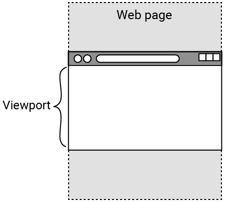

## Add hero images

Put some cool images at the top of your webpage to show everyone what it's about!
<iframe src="https://editor.raspberrypi.org/en/embed/viewer/welcome-to-antarctica-step4" width="100%" height="800" frameborder="0" marginwidth="0" marginheight="0" allowfullscreen> </iframe>

### Add a hero image to the header

A large full width image at the top of a page is called a **hero image**.

--- task ---

Add a new `
` element to the `<header>`.

Give the new `
` a class attribute of `hero-image`.

--- code ---
---
language: html
filename: index.html
line_numbers: true
line_number_start: 11
line_highlights: 19
---

    <header>
      <nav>
        

          <a href="index.html" class="active">Home</a>
          <a href="wildlife.html">Wildlife</a>
          <a href="climate.html">Climate</a>
        

      </nav>
      

    </header>

--- /code ---

--- /task ---

--- task ---

In `style.css`, add a new selector for the `hero-image` class.

Instead of adding an `` element to the HTML, you can use the CSS `background-image` property to add your image. 

The image should fill the `
` element (by setting the `background-size` property to `cover`) and be centered.

--- code ---
---
language: css
filename: style.css
line_numbers: true
line_number_start: 73
line_highlights: 74-79
---

/* Hero image - homepage */
.hero-image {
  min-height: 50vh; /* 50% of the visible area of the page */
  background-image: url('antarctic-northern-lights.jpg'); 
  background-size: cover;
  background-position: center;
}

--- /code ---

--- collapse ---

---
title: Using vh and vw in CSS
---

When setting the size of an element using CSS, you might want the height or width to change depending on the size of the screen it is being viewed on. 

The visible area of a webpage is called the **viewport** and this will differ between devices: a phone screen is a very different size to a laptop screen, for example. 

In CSS you can use `vh` to set the size of elements relative to the **height** of the viewport. The number you put before it is the **percentage** of the viewport height the element should take up. So `50vh` is **half** the viewport's height. 

`vw` works the same way for the **width** of the viewport.

--- /collapse ---

--- /task ---

--- task ---

**Click Run**

--- /task ---

### Copy the header

`index.html` is looking great! Time to add the header to the other pages.

--- task ---

Highlight and copy (Ctrl + C or Cmd + C) the contents of the `<header>` section in `index.html`.

--- code ---
---
language: html
filename: index.html
line_numbers: true
line_number_start: 12
---
      <nav>
        

          <a href="index.html" class="active">Home</a>
          <a href="wildlife.html">Wildlife</a>
          <a href="climate.html">Climate</a>
        

      </nav>
      

--- /code ---

--- /task ---

--- task ---

Open the `wildlife.html` file.

Paste the contents into the `<header>` and change which link has the active class.

--- code ---
---
language: html
filename: wildlife.html
line_numbers: true
line_number_start: 11
line_highlights: 12-19
---
    <header>
      <nav class="navigation-header">
        

          <a href="index.html">Home</a>
          <a href="wildlife.html" class="active">Wildlife</a>
          <a href="climate.html">Climate</a>
        

      </nav>
      

    </header>

--- /code ---

--- /task ---

--- task ---

**Click Run**

--- collapse ---

---
title: The Home link is still white?
---

Check the `index.html` link has active removed and `wildlife.html` has active added.

--- /collapse ---

--- /task ---

--- task ---

Highlight and copy (Ctrl + C or Cmd + C) the contents of the `<header>` section in `index.html` again.

--- /task ---

--- task ---

Paste the `<header>` contents into `climate.html` and change which link has the active class.

--- code ---
---
language: html
filename: climate.html
line_numbers: true
line_number_start: 11
line_highlights: 12-19
---
    <header>
      <nav class="navigation-header">
        

          <a href="index.html">Home</a>
          <a href="wildlife.html">Wildlife</a>
          <a href="climate.html" class="active">Climate</a>
        

      </nav>
      

    </header>

--- /code ---

--- /task ---

--- task ---

**Click Run**

--- collapse ---

---
title: My Home link is still white?
---

Check the `index.html` link has active removed and `climate.html` has active added.

--- /collapse ---

--- /task ---

### Style the Wildlife page header

The other pages should have different hero images that represent their content!

--- task ---

Inside `style.css` add a new class selector for wildlife.

You can set a new `background-image` property, which will overwrite the one set in the `hero-image` class.

--- code ---
---
language: css
filename: style.css
line_numbers: true
line_number_start: 81
line_highlights: 82-84
---
/* Hero image - wildlife */
.wildlife {
  background-image: url('antarctic-penguins.jpg');
}

--- /code ---

--- /task ---

--- task ---

Now apply the new `wildlife` class as an **addition** to the `hero-image` class in `wildlife.html`.

--- code ---
---
language: html
filename: wildlife.html
line_numbers: true
line_number_start: 18
line_highlights: 19
---
      </nav>
      

--- /code ---

--- /task ---

--- task ---

**Click Run**

--- collapse ---

---
title: My hero image has disappeared?
---

Make sure there is a space between the `hero-image` and `wildlife` classes.

--- /collapse ---

--- /task ---

### Style the Climate page header

--- task ---

Inside `style.css`, add another new class selector for climate.

--- code ---
---
language: css
filename: style.css
line_numbers: true
line_number_start: 86
line_highlights: 87-89
---
/* Hero image - climate */
.climate {
  background-image: url('antarctic-daytime.jpg');
}

--- /code ---

--- /task ---

--- task ---

Now apply the new `climate` class as an **addition** to the `hero-image` class in `climate.html`.

--- code ---
---
language: html
filename: climate.html
line_numbers: true
line_number_start: 10
line_highlights: 18
---

      </nav>
      

--- /code ---

--- /task ---

--- task ---

**Click Run**

--- /task ---

Next, you will make your webpages awesome by arranging things with grids and adding fun movements with animations!
