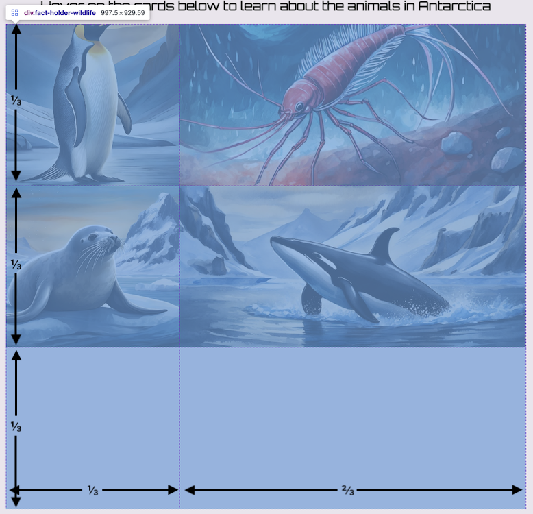

## Different types of grids

Use a new grid arrangement on the wildlife page to organise the fact cards in a different way to keep things interesting!

<iframe src="https://staging-editor.raspberrypi.org/en/embed/viewer/welcome-to-antarctica-step6" width="100%" height="800" frameborder="0" marginwidth="0" marginheight="0" allowfullscreen> </iframe>

### Change the title of the wildlife page

--- task ---

Open `wildlife.html`

Change the `h1` text.

--- code ---
---
language: html
filename: wildlife.html
line_numbers: true
line_number_start: 
line_highlights: 
---
    <section>
      <h1>Hover on the cards below to learn about the animals in Antarctica</h1>
    
--- /code ---

**Click the Run button** to see your changes.

--- /task ---

### Add a grid to the wildlife page

--- task ---

Add the `fact-holder` class attribute to the `
`.

Add a `fact-card` and a background image class to each `` element.

Add the `fact` class attribute to each paragraph.

--- code ---
---
language: html
filename: wildlife.html
line_numbers: true
line_number_start: 25
line_highlights: 26, 27, 28, 32, 33, 37, 38, 42, 43
---
<section>
  

    
      

        Emperor penguins, live in colonies on sea ice. Sea ice is frozen sea water which fringes the Antarctic continent. In the winter sea ice expands. In the summer, it shrinks as the sea ice melts. By the time the chicks are ready to fledge, the sea ice edge is close to the colony, so the young penguins don’t have to travel far to get their food.
      

    
    
      

        Krill is eaten by many other organisms such as penguins, birds, or even ginormous elephant seals! Because there are so many different organisms feeding from the krill, there needs to be lots and lots of krill available, especially as they are only 2 inches long!
      

    
    
      

        Seals have thick beautiful fur coats and blubber, making them supremely adapted to the cold. There are six species in Antarctica: Antarctic Fur Seals, Leopard Seals, Ross Seals, Southern Elephant seals, Crabeater Seals and Weddell Seals.
      

    
    
      

        At the top of the food chain, there are Orcas, often known as Killer Whales. These are the biggest carnivores on Earth, reaching almost 10m in length! They can be found swimming all around the Earth’s oceans, but in particular in the Southern Ocean around Antarctica.
      

    
  

</section>
    
--- /code ---

**Click the Run button** to see your changes.

--- /task ---

There are different ways to size your grid layout, you can use `fr` to create **fractions** of the sizing.

--- collapse ---

---
title: Using fractions for sizing grids
---

Rather than using percentages and having to check they add up to 100% you can instead use fractions of the space. 

To do this you use the unit `fr` - so if you wanted four columns that are each a quarter of the width of the grid you would use this CSS;

~~~css
grid-columns: 1fr 1fr 1fr 1fr 
~~~

There are **4** in total and each column is 1/4 in width. 

They don't have to be even either. You could also do 2 rows, one that is 3/4 and the other is 1/4:

~~~css
grid-rows: 3fr 1fr
~~~

--- /collapse ---

--- task ---

Open `style.css`

Add the `fact-holder-wildlife` selector to the `style.css` file.

--- code ---
---
language: css
filename: style.css
line_numbers: true
line_number_start: 103
line_highlights: 104-109
---

/* Fact holder - wildlife */
.fact-holder-wildlife {
  display: grid;
  height: 70vh;
  grid-template-rows: 1fr 1fr 1fr;
  grid-template-columns: 2fr 3fr;
}

--- /code ---

--- /task ---

--- task ---

Open `wildlife.html`.

Change the class attribute on the `
` to your new `fact-holder-wildlife` class.

--- code ---
---
language: html
filename: wildlife.html
line_numbers: true
line_number_start: 26
line_highlights: 26
---
  

    
        

        Emperor penguins ...

--- /code ---

**Click the Run button** to see your changes.

Now your wildlife grid has 3 rows that take up a third of the space each, and two columns that are 1/3 and 2/3 of the width.

--- /task ---

Grid layout will automatically position your items. You can also specify how you want items to be displayed.

You will make it so the penguin fact stretches over two rows, and the orca fact takes up the whole last row.

--- task ---

Add `grid-row-start` to `.penguins` and set it to `1`.

Add `grid-row-end ` to `.penguins` and set it to `3`.

--- code ---
---
language: css
filename: style.css
line_numbers: true
line_number_start: 163
line_highlights: 165-166
---

.penguins {
  background-image: url('penguin-photo.jpg');
  grid-row-start: 1;
  grid-row-end: 3;
}

--- /code ---

The `grid-row-start` property is the **first** row the element will display in. 

`grid-row-end` is the row where the element ends - the image will **not** display on this row. It is **1** more than you think it will be.

**Click the Run button** to see your changes.

--- /task ---

--- task ---

Add `grid-column-start` to `.orcas` and set it to `1`.

Add `grid-column-end ` to `.orcas` and set it to `3`.

--- code ---
---
language: css
filename: style.css
line_numbers: true
line_number_start: 177
line_highlights: 179-180
---

.orcas {
  background-image: url('orca-photo.jpg');
  grid-column-start: 1;
  grid-column-end: 3;
}

--- /code ---

**Click the Run button** to see your changes.

--- /task ---

### Change the title of the climate page

--- task ---

Open `climate.html`.

Change the `h1` text.

--- code ---
---
language: html
filename: wildlife.html
line_numbers: true
line_number_start: 22
line_highlights: 23
---
    <section>
      <h1>Hover on the cards below to learn about the climate in Antarctica</h1>
    
--- /code ---

**Click the Run button** to see your changes.

--- /task ---

### Add a grid to the climate page

--- task ---

Add the `fact-holder` class attribute to the `
`.

Add a `fact-card` and a background image class to each `` element.

Add the `fact` class attribute to each paragraph.

--- code ---
---
language: html
filename: climate.html
line_numbers: true
line_number_start: 25
line_highlights: 26, 27, 28, 32, 33, 37, 38, 42, 43
---
  <section>
    

      
        

          Antarctica is the coldest continent on Earth. The average temperature in the interior is -57°C, during winter it can reach -90°C. The coast is warmer and temperatures can reach a maximum of 8°C during the summer.
        

      
      
        

          It is possible to get sunburn on Antarctica, the snow reflects nearly all the ultraviolet rays. You may not feel the heat, but you still need to keep your skin safe from the rays.
        

      
      
        

          This ice sheet is, on average, 1.6 km thick and covers about 98% of the entire continent. This ice sheet is nearly 90% of the entire world’s ice, so it’s no wonder the Antarctic climate is so cold!
        

      
      
        

          Technically, Antarctica is a desert because it is so dry there. The average annual precipitation on the coast is just 166mm. With such cold conditions the snow hardly ever melts; instead, it will mostly become compressed over time to form part of the ice sheet.
        

      
    

  </section>
    
--- /code ---

**Click the Run button** to see your changes.

--- /task ---

Next you will make your content smart. No matter if the page is big or small, or if someone is using a different device, it will always look amazing.