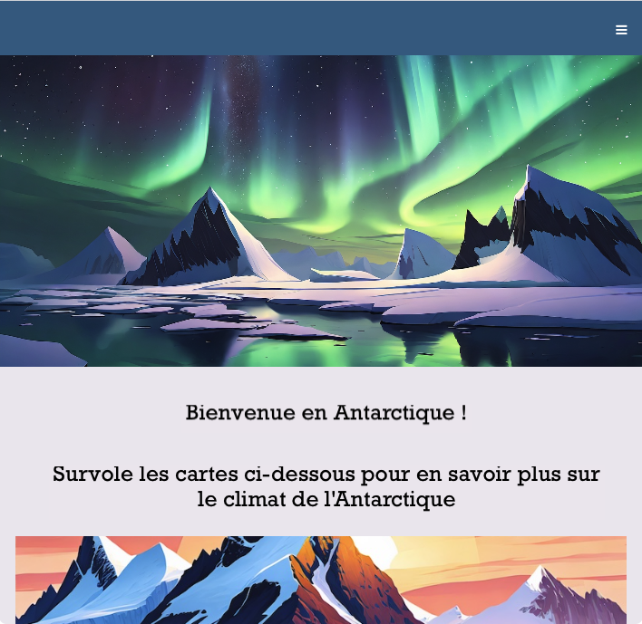

## Introduction

\--- collapse ---

---

## title: Tu utilises le Raspberry Pi Code Editor pour la première fois ?

Consulte le [guide de démarrage](https://projects.raspberrypi.org/en/projects/getting-started-guide-editor-html){:target="_blank"} !

\--- /collapse ---

Dans ce projet, tu utiliseras HTML, CSS, et JavaScript pour créer un site web qui permet aux gens de découvrir un endroit qu’ils n’auront peut-être jamais l’occasion de visiter : l’Antarctique.

En plus de la page d'accueil, le site web comportera des pages sur la faune et le climat de l'Antarctique.

**JavaScript** est un langage de programmation qui s'exécute dans ton navigateur. En 2024, c'est le langage de programmation le plus populaire au monde !

Tu vas :

- Créer un site web moderne et attrayant
- Concevoir une barre de navigation (navbar)
- Définir des couleurs et polices accessibles
- Ajouter des images « hero »
- Utiliser une disposition en grille
- Placer des éléments dans une grille
- Rendre les éléments réactifs

\--- no-print ---

\--- task ---

### Essaie-le

Découvre le site web Bienvenue en l'Antarctique.

Que se passe-t-il lorsque tu...

- Cliques sur l'icône hamburger (☰) ?
- Survoles les images ?
- Utilises les liens pour accéder aux différentes pages ?

<iframe src="https://editor.raspberrypi.org/en/embed/viewer/welcome-to-antarctica-complete" width="100%" height="900" frameborder="0" marginwidth="0" marginheight="0" allowfullscreen> </iframe>

\--- collapse ---

---

## title: Images dans ce projet

Les images incluses dans ce projet ont été créées à l'aide de l'IA générative. Model: Firefly Image 2

\--- /collapse ---

\--- /task ---

\--- /no-print ---

\--- print-only ---

\--- /print-only ---
