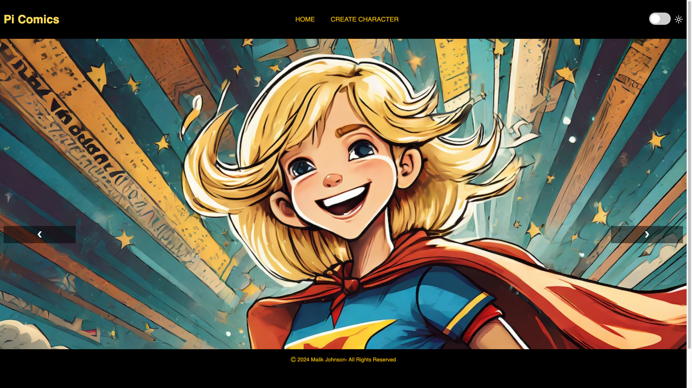

## What next?

If you are following the [More web](https://projects.raspberrypi.org/en/pathways/more-web) path, you can move on to the [Comic character](https://projects.raspberrypi.org/en/projects/comic-character) project. In this project, you will create a website where your users can design their own superhero character.

\--- print-only ---

\--- /print-only ---

\--- no-print ---

### Try it

  
Explore the Superhero website. 

- Click the arrows on the hero image slider to move through the images
- Toggle the light mode button to see the theme colours on the site change
- Navigate to the Create Character page and complete the input fields to create your own superhero character!

<iframe src="https://editor.raspberrypi.org/en/embed/viewer/comic-character-complete" width="100%" height="800" frameborder="0" marginwidth="0" marginheight="0" allowfullscreen> </iframe>

\--- /no-print ---
