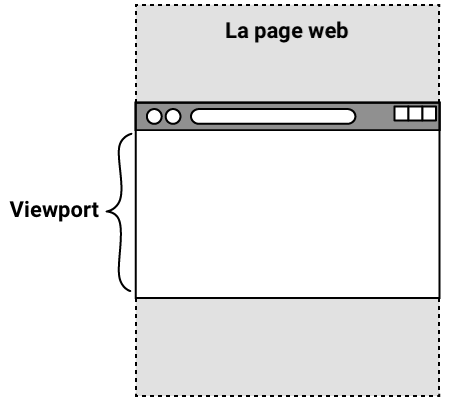

## Ajouter des images Hero

Mets des images sympas en haut de ta page web pour montrer à tout le monde de quoi il s'agit !

<iframe src="https://editor.raspberrypi.org/en/embed/viewer/welcome-to-antarctica-step4" width="100%" height="800" frameborder="0" marginwidth="0" marginheight="0" allowfullscreen> </iframe>

### Ajouter une image Hero à l'en-tête

Une grande image pleine largeur en haut d'une page s'appelle une **image Hero**.

\--- task ---

Ajoute un nouvel élément `<div>` au `<header>`.

Donne au nouveau `<div>` un attribut de classe de `hero-image`.

## --- code ---

language: html
filename: index.html
line_numbers: true
line_number_start: 11
line_highlights: 19
--------------------------------------------------------

```
<header>
  <nav>
    <div class="nav-items">
      <a href="index.html" class="active">Accueil</a>
      <a href="wildlife.html">Faune</a>
      <a href="climate.html">Climat</a>
    </div>
  </nav>
  <div class="hero-image"></div>
</header>
```

\--- /code ---

\--- /task ---

\--- task ---

Dans `style.css`, ajoute un nouveau sélecteur pour la classe `hero-image`.

Au lieu d'ajouter un élément `` au code HTML, tu peux utiliser la propriété CSS `background-image` pour ajouter ton image.

L'image doit remplir l'élément `<div>` (en définissant la propriété `background-size` à `cover`) et être centrée.

## --- code ---

language: css
filename: style.css
line_numbers: true
line_number_start: 73
line_highlights: 74-79
-----------------------------------------------------------

/\* Image Hero - page d'accueil _/
.hero-image {
min-height: 50vh; /_ 50 % de la zone visible de la page \*/
background-image: url('antarctic-lights.jpg');
background-size: cover;
background-position: center;
}

\--- /code ---

\--- collapse ---

---

## title: Utiliser vh et vw en CSS

Lorsque tu définis la taille d'un élément à l'aide de CSS, tu peux souhaiter que la hauteur ou la largeur change en fonction de la taille de l'écran sur lequel il est visualisé.



La zone visible d'une page web est appelée **viewport** et elle diffère selon les appareils : l'écran d'un téléphone n'a pas du tout la même taille que celui d'un ordinateur portable, par exemple.

En CSS, tu peux utiliser `vh` pour définir la taille des éléments par rapport à la **hauteur** de la fenêtre. Le nombre que tu places devant est le **pourcentage** de la hauteur de la fenêtre que l'élément doit occuper. Donc `50vh` est la **moitié** de la hauteur de la fenêtre.

`vw` fonctionne de la même manière pour la **largeur** de la fenêtre.

\--- /collapse ---

\--- /task ---

\--- task ---

**Clique sur Run**

\--- /task ---

### Copier l'en-tête

Le fichier `index.html` est superbe ! Il est temps d'ajouter l'en-tête aux autres pages.

\--- task ---

Sélectionne et copie (Ctrl + C ou Cmd + C) le contenu de la section `<header>` dans `index.html`.

## --- code ---

language: html
filename: index.html
line_numbers: true
line_number_start: 12
-------------------------------------------------------------------------------

```
  <nav>
    <div class="nav-items">
      <a href="index.html" class="active">Accueil</a>
      <a href="wildlife.html">Faune</a>
      <a href="climate.html">Climat</a>
    </div>
  </nav>
  <div class="hero-image"></div>
```

\--- /code ---

\--- /task ---

\--- task ---

Ouvre le fichier `wildlife.html`.

Colle le contenu dans le `<header>` et change le lien qui a la classe active.

## --- code ---

language: html
filename: wildlife.html
line_numbers: true
line_number_start: 11
line_highlights: 12-19
-----------------------------------------------------------

```
<header>
  <nav class="navigation-header">
    <div class="nav-items">
      <a href="index.html">Accueil</a>
      <a href="wildlife.html" class="active">Faune</a>
      <a href="climate.html">Climat</a>
    </div>
  </nav>
  <div class="hero-image"></div>
</header>
```

\--- /code ---

\--- /task ---

\--- task ---

**Clique sur Run**

\--- collapse ---

---

## title: Le lien Accueil est toujours blanc ?

Vérifie que le lien `index.html` a été supprimé et que le lien `wildlife.html` a été ajouté.

\--- /collapse ---

\--- /task ---

\--- task ---

Sélectionne et copie (Ctrl + C ou Cmd + C) le contenu de la section `<header>` dans `index.html` à nouveau.

\--- /task ---

\--- task ---

Colle le contenu `<header>` dans `climate.html` et change le lien qui a la classe active.

## --- code ---

language: html
filename: climate.html
line_numbers: true
line_number_start: 11
line_highlights: 12-19
-----------------------------------------------------------

```
<header>
  <nav class="navigation-header">
    <div class="nav-items">
      <a href="index.html">Accueil</a>
      <a href="wildlife.html">Faune</a>
      <a href="climate.html" class="active">Climat</a>
    </div>
  </nav>
  <div class="hero-image"></div>
</header>
```

\--- /code ---

\--- /task ---

\--- task ---

**Clique sur Run**

\--- collapse ---

---

## title: Mon lien Accueil est toujours blanc ?

Vérifie que le lien `index.html` a été supprimé et que le lien `climate.html` a été ajouté.

\--- /collapse ---

\--- /task ---

### Styliser l'en-tête de la page Faune

Chaque page doit avoir sa propre image Hero qui représente son contenu !

\--- task ---

Dans `style.css`, ajoute un nouveau sélecteur de classe pour la faune.

Tu peux définir une nouvelle propriété `background-image`, qui remplacera celle définie dans la classe `hero-image`.

## --- code ---

language: css
filename: style.css
line_numbers: true
line_number_start: 81
line_highlights: 82-84
-----------------------------------------------------------

/\* Image Hero - faune \*/
.wildlife {
background-image: url('antarctic-penguins.jpg');
}

\--- /code ---

\--- /task ---

\--- task ---

Applique maintenant la nouvelle classe `wildlife` comme **ajout** à la classe `hero-image` dans `wildlife.html`.

## --- code ---

language: html
filename: wildlife.html
line_numbers: true
line_number_start: 18
line_highlights: 19
--------------------------------------------------------

```
  </nav>
  <div class="hero-image wildlife"></div>
```

\--- /code ---

\--- /task ---

\--- task ---

**Clique sur Run**

\--- collapse ---

---

## title: Mon image Hero a disparu ?

Assure-toi qu'il y a un espace entre les classes `hero-image` et `wildlife`.

\--- /collapse ---

\--- /task ---

### Styliser l'en-tête de la page Climat

\--- task ---

Dans `style.css`, ajoute un nouveau sélecteur de classe pour le climat.

## --- code ---

language: css
filename: style.css
line_numbers: true
line_number_start: 86
line_highlights: 87-89
-----------------------------------------------------------

/\* Image Hero - climat \*/
.climate {
background-image: url('antarctic-daytime.jpg');
}

\--- /code ---

\--- /task ---

\--- task ---

Applique maintenant la nouvelle classe `climate` comme **ajout** à la classe `hero-image` dans `climate.html`.

## --- code ---

language: html
filename: climate.html
line_numbers: true
line_number_start: 10
line_highlights: 18
--------------------------------------------------------

```
  </nav>
  <div class="hero-image climate"></div>
```

\--- /code ---

\--- /task ---

\--- task ---

**Clique sur Run**

\--- /task ---

Ensuite, tu rendras tes pages web géniales en organisant les choses avec des grilles et en ajoutant des mouvements amusants avec des animations !
