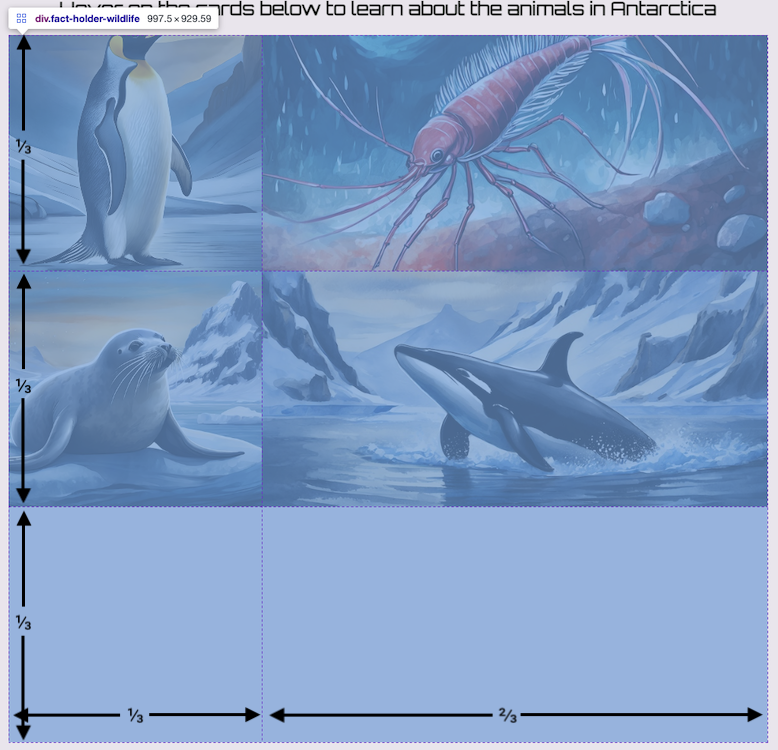

## Différents types de grilles

Utilise une nouvelle grille pour la page Faune afin de réorganiser les cartes de faits et de maintenir l'intérêt !

<iframe src="https://editor.raspberrypi.org/en/embed/viewer/welcome-to-antarctica-step7" width="100%" height="800" frameborder="0" marginwidth="0" marginheight="0" allowfullscreen> </iframe>

### Changer l'en-tête de la page Faune

\--- task ---

Ouvre `wildlife.html`.

Modifie le texte `h1`.

## --- code ---

language: html
filename: wildlife.html
line_numbers: true
line_number_start:
line_highlights:
-----------------------------------------------------

```
<section>
  <h1>Survole les cartes ci-dessous pour en savoir plus sur les animaux de l'Antarctique.</h1>
```

\--- /code ---

\--- /task ---

\--- task ---

**Clique sur Run**

\--- /task ---

### Ajouter une grille à la page Faune

\--- task ---

Ajoute l'attribut de classe `fact-holder` au `<div>`.

Ajoute une classe `fact-card` et une classe d'image d'arrière-plan à chaque élément `<span>`.

Ajoute l'attribut de classe `fact` à chaque paragraphe.

## --- code ---

language: html
filename: wildlife.html
line_numbers: true
line_number_start: 23
line_highlights: 27-29, 33-34, 38-39, 43-44
--------------------------------------------------------------------------------

<section>
  <h1>
    Survole les cartes ci-dessous pour en savoir plus sur les animaux de l'Antarctique
  </h1>
  <div class="fact-holder">
    <span class="fact-card penguins">
      <p class="fact">
        Les manchots empereurs vivent en colonies sur la banquise. La banquise est l'eau de mer gelée qui borde le continent antarctique. En hiver, la banquise s'étend. En été, elle rétrécit à mesure de la fonte de la banquise. Lorsque les poussins sont prêts à s'envoler, la limite de la banquise est déjà proche de la colonie. Les jeunes manchots n'ont donc pas besoin de parcourir de longues distances pour trouver de la nourriture.
      </p>
    </span>
    <span class="fact-card krill">
      <p class="fact">
        Le krill est consommé par de nombreux autres organismes tels que les pingouins, les oiseaux ou même les gigantesques éléphants de mer ! Étant donné le grand nombre d'organismes différents qui se nourrissent du krill, il faut disposer d'une grande quantité de krill, d'autant plus qu'il ne mesure que 5 cm de long !
      </p>
    </span>
    <span class="fact-card seals">
      <p class="fact">
        Les phoques sont dotés d'un épais et magnifique manteau de fourrure et de graisse, ce qui les rend extrêmement bien adaptés au froid. L'Antarctique compte six espèces : l'otarie à fourrure de l'Antarctique, le léopard de mer, le phoque de Ross, l'éléphant de mer du Sud, le phoque crabier et le phoque de Weddell.
      </p>
    </span>
    <span class="fact-card orcas">
      <p class="fact">
        Au sommet de la chaîne alimentaire se trouvent les orques, souvent appelées épaulards. Ce sont les plus grands carnivores de la planète, atteignant près de 10 m de long ! On les trouve dans tous les océans de la planète, mais surtout dans l'océan Austral, autour de l'Antarctique.
      </p>
    </span>  
</div>
</section>

\--- /code ---

\--- /task ---

\--- task ---

**Clique sur Run**

\--- /task ---

Il existe différentes façons de dimensionner ta grille. Par exemple, tu peux utiliser `fr` pour créer des **fractions** de la taille.

\--- collapse ---

---

## title: Utiliser des fractions pour dimensionner les grilles

Plutôt que d'utiliser des pourcentages et de devoir vérifier que leur somme est égale à 100 %, tu peux utiliser des fractions de l'espace.

Pour cela, tu utilises l'unité `fr` - donc si tu veux quatre colonnes qui font chacune un quart de la largeur de la grille, tu utiliseras ce CSS :

```css
grid-columns: 1fr 1fr 1fr 1fr 
```

Il y a **4** au total et chaque colonne a une largeur de 1/4.

Il n'est pas nécessaire que les colonnes soient égales. Tu peux aussi faire 2 lignes, l'un de 3/4 et l'autre de 1/4 :

```css
grid-rows: 3fr 1fr
```

\--- /collapse ---

\--- task ---

Ouvre `style.css`.

Ajoute le sélecteur `fact-holder-wildlife` au fichier `style.css`.

## --- code ---

language: css
filename: style.css
line_numbers: true
line_number_start: 100
line_highlights: 101-106
-------------------------------------------------------------

/\* Détenteur de faits - faune \*/
.fact-holder-wildlife {
display: grid;
height: 70vh;
grid-template-rows: 1fr 1fr 1fr;
grid-template-columns: 2fr 3fr;
}

\--- /code ---

\--- /task ---

\--- task ---

Ouvre `wildlife.html`.

Remplace l'attribut de classe du `<div>` par ta nouvelle classe `fact-holder-wildlife`.

## --- code ---

language: html
filename: wildlife.html
line_numbers: true
line_number_start: 27
line_highlights: 27
--------------------------------------------------------

  <div class="fact-holder-wildlife">
    <span class="fact-card penguins">
        <p class="fact">
        Les manchots empereurs ...

\--- /code ---

\--- /task ---

\--- task ---

**Clique sur Run**

Maintenant, ta grille d'animaux sauvages comporte 3 lignes qui occupent chacune un tiers de l'espace, et 2 colonnes qui font 1/3 et 2/3 de la largeur.



\--- /task ---

La grille positionnera automatiquement tes éléments. Cependant, tu peux aussi spécifier la façon dont tu veux que les éléments soient affichés.

Tu peux faire en sorte que le fait du pingouin s'étende sur deux lignes et que le fait de l'orque s'étende sur les deux colonnes de la dernière ligne, par exemple.

\--- task ---

Ajoute `grid-row-start` à `.penguins` et règle-la à `1`.

Ajoute `grid-row-end` à `.penguins` et règle-la à `3`.

## --- code ---

language: css
filename: style.css
line_numbers: true
line_number_start: 157
line_highlights: 159-160
-------------------------------------------------------------

.penguins {
background-image: url('penguin-photo.jpg');
grid-row-start: 1;
grid-row-end: 3;
}

\--- /code ---

La propriété `grid-row-start` est la **première** ligne dans laquelle l'élément s'affichera.

Et `grid-row-end` est la ligne où l'élément se termine, l'image ne s'affichera **pas** sur cette ligne.

\--- /task ---

\--- task ---

**Clique sur Run**

\--- /task ---

\--- task ---

Ajoute `grid-column-start` à `.penguins` et règle-la à `1`.

Ajoute `grid-column-end` à `.penguins` et règle-la à `3`.

## --- code ---

language: css
filename: style.css
line_numbers: true
line_number_start: 171
line_highlights: 173-174
-------------------------------------------------------------

.orcas {
background-image: url('orca-photo.jpg');
grid-column-start: 1;
grid-column-end: 3;
}

\--- /code ---

\--- /task ---

\--- task ---

**Clique sur Run**

\--- /task ---

### Changer l'en-tête de la page Climat

\--- task ---

Ouvre `climate.html`.

Modifie le texte `h1`.

## --- code ---

language: html
filename: climate.html
line_numbers: true
line_number_start: 22
line_highlights: 23
--------------------------------------------------------

```
<section>
  <h1>Survole les cartes ci-dessous pour en savoir plus sur le climat de l'Antarctique.</h1>
```

\--- /code ---

\--- /task ---

\--- task ---

**Clique sur Run**

\--- /task ---

### Ajouter une grille à la page Climat

\--- task ---

Ajoute l'attribut de classe `fact-holder` au `<div>`.

Ajoute une classe `fact-card` et une classe d'image d'arrière-plan à chaque élément `<span>`.

Ajoute l'attribut de classe `fact` à chaque paragraphe.

## --- code ---

language: html
filename: climate.html
line_numbers: true
line_number_start: 23
line_highlights: 25-27, 31-32, 36-37, 41-42
--------------------------------------------------------------------------------

  <section>
    <h1>Survole les cartes ci-dessous pour en savoir plus sur le climat de l'Antarctique</h1>
    <div class="fact-holder">
      <span class="fact-card temperature">
          <p class="fact">
            L'Antarctique est le continent le plus froid de la planète. La température moyenne à l'intérieur des terres est de -57°C, en hiver, elle peut atteindre -90°C. La côte est plus chaude et les températures peuvent atteindre un maximum de 8°C en été.
        </p>
        </span>
        <span class="fact-card sunburn">
          <p class="fact">
            Tu peux attraper des coups de soleil en Antarctique, la neige reflète presque tous les rayons ultraviolets du soleil. Tu ne sens peut-être pas la chaleur, mais tu dois quand même protéger ta peau des rayons du soleil.
        </p>
      </span>
      <span class="fact-card ice">
        <p class="fact">
          Cette calotte glaciaire a une épaisseur moyenne de 1,6 km et couvre environ 98 % de l'ensemble du continent. Cette calotte glaciaire représente près de 90 % de la glace mondiale, il n'est donc pas étonnant que le climat de l'Antarctique soit si froid !
        </p>
      </span>
      <span class="fact-card rainfall">
        <p class="fact">
          Techniquement, l'Antarctique est un désert parce qu'il y fait très sec. Les précipitations annuelles moyennes sur la côte ne sont que de 166 mm. Avec des conditions aussi froides, la neige ne fond pratiquement jamais ; au lieu de cela, elle se comprime au fil du temps pour former une partie de la couche de glace.
        </p>
      </span>    
</div>
  </section>

\--- /code ---

\--- /task ---

\--- task ---

**Clique sur Run**

\--- /task ---

Ensuite, tu rendras ton contenu intelligent. Peu importe que la page soit grande ou petite, ou que quelqu'un utilise un appareil différent, la page a toujours fière allure.
