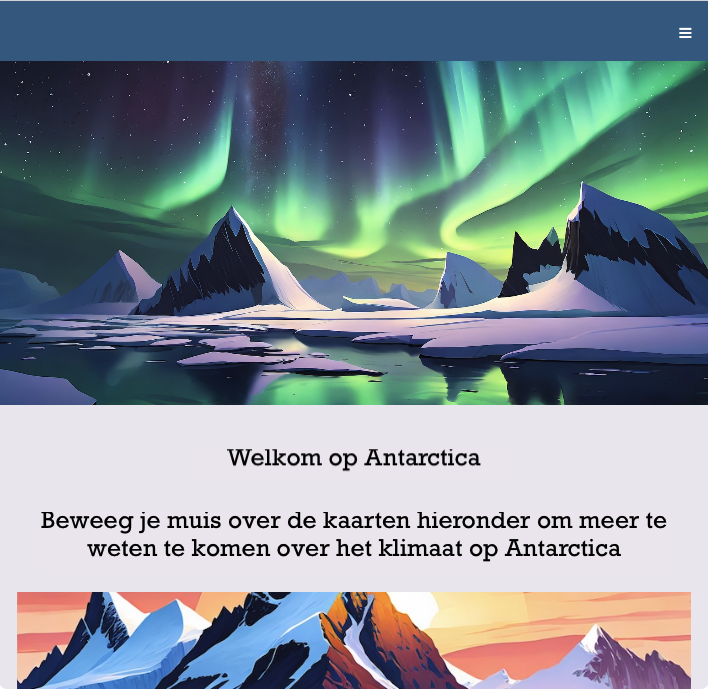

## Inleiding

\--- collapse ---

---

## title: Gebruik je de Raspberry Pi Code Editor voor de eerste keer?

Bekijk de [aan de slag-handleiding](https://projects.raspberrypi.org/en/projects/getting-started-guide-editor-html){:target="_blank"}!

\--- /collapse ---

In dit project ga je HTML, CSS en JavaScript gebruiken om een website te maken waarmee mensen een plek kunnen ontdekken die ze anders misschien nooit zouden bezoeken: Antarctica.

Naast de homepage bevat de website ook pagina's over de wilde dieren en het klimaat van Antarctica.

**JavaScript** is een programmeertaal die in je browser wordt gebruikt. Sinds 2024 is het de populairste programmeertaal ter wereld!

Je gaat:

- Een geweldige, moderne website maken
- Een navigatiebalk (navbar) maken
- Toegankelijke kleuren en lettertypen instellen
- Wat 'hero' afbeeldingen toevoegen
- Een grid (raster) layout gebruiken
- Items in een raster plaatsen
- Elementen responsief maken

\--- no-print ---

\--- task ---

### Probeer het uit

Ontdek de Welkom op Antarctica-website.

Wat gebeurt er wanneer je...

- Op het hamburgericoontje (☰) klikt?
- Met de muis over de afbeeldingen beweegt?
- De links gebruikt om de verschillende pagina's te bekijken?

<iframe src="https://editor.raspberrypi.org/en/embed/viewer/welcome-to-antarctica-complete" width="100%" height="900" frameborder="0" marginwidth="0" marginheight="0" allowfullscreen> </iframe>

\--- collapse ---

---

## title: Afbeeldingen in dit project

Afbeeldingen die zijn opgenomen in dit project zijn gemaakt met behulp van generatieve AI. Model: Firefly Image 2

\--- /collapse ---

\--- /task ---

\--- /no-print ---

\--- print-only ---

\--- /print-only ---
