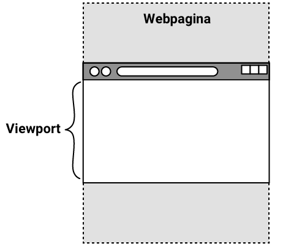

## Voeg hero-afbeeldingen toe

Plaats een aantal leuke afbeeldingen bovenaan je webpagina zodat iedereen kan zien waar het over gaat!

<iframe src="https://editor.raspberrypi.org/en/embed/viewer/welcome-to-antarctica-step4" width="100%" height="800" frameborder="0" marginwidth="0" marginheight="0" allowfullscreen> </iframe>

### Een hero afbeelding toevoegen aan de koptekst

Een grote afbeelding over de volledige breedte bovenaan een pagina wordt een **hero-image** genoemd.

\--- task ---

Voeg een nieuw `<div>` element toe aan `<header>`.

Geef de nieuwe `<div>` een class attribuut van `hero-image`.

## --- code ---

language: html
filename: index.html
line_numbers: true
line_number_start: 11
line_highlights: 19
--------------------------------------------------------

```
<header>
  <nav>
    <div class="nav-items">
      <a href="index.html" class="active">Home</a>
      <a href="wildlife.html">Wilde dieren</a>
      <a href="climate.html">Klimaat</a>
    </div>
  </nav>
<div class="hero-image"></div>
</header>
```

\--- /code ---

\--- /task ---

\--- task ---

Voeg in `style.css` een nieuwe selector toe voor de `hero-image` class.

In plaats van een `` element toe te voegen aan de HTML, kun je de CSS `background-image` eigenschap gebruiken om je afbeelding toe te voegen.

De afbeelding moet het element `<div>` vullen (door de eigenschap `background-size` in te stellen op `cover`) en gecentreerd zijn.

## --- code ---

language: css
filename: style.css
line_numbers: true
line_number_start: 73
line_highlights: 74-79
-----------------------------------------------------------

/\* Hero image - homepage _/
.hero-image {
min-height: 50vh; /_ 50% van het zichtbare gebied van de pagina\*/
background-image: url('antarctic-lights.jpg');
background-size: cover;
background-position: center;
}

\--- /code ---

\--- collapse ---

---

## title: vh en vw gebruiken in CSS

Bij het instellen van de grootte van een element met behulp van CSS, wil je misschien dat de hoogte of breedte wijzigt afhankelijk van de grootte van het scherm waarop het wordt bekeken.



Het zichtbare gedeelte van een webpagina wordt de **viewport** genoemd. Dit verschilt per apparaat: het scherm van een telefoon is bijvoorbeeld heel anders van formaat dan dat van een laptop.

In CSS kun je `vh` gebruiken om de grootte van elementen in te stellen ten opzichte van de **hoogte** van de viewport. Het getal dat je ervoor plaatst, is het **percentage** van de viewporthoogte dat het element moet innemen. `50vh` is dus **de helft** van de hoogte van de viewport.

`vw` werkt op dezelfde manier voor de **breedte** van de viewport.

\--- /collapse ---

\--- /task ---

\--- task ---

**Klik op Run**

\--- /task ---

### Kopieer de header

`index.html` ziet er geweldig uit! Tijd om de header aan de andere pagina's toe te voegen.

\--- task ---

Markeer en kopieer (Ctrl + C of Cmd + C) de inhoud van de sectie `<header>` in `index.html`.

## --- code ---

language: html
filename: index.html
line_numbers: true
line_number_start: 12
-------------------------------------------------------------------------------

```
  <nav>
    <div class="nav-items">
      <a href="index.html" class="active">Home</a>
      <a href="wildlife.html">Wilde dieren</a>
      <a href="climate.html">Klimaat</a>
    </div>
  </nav>
  <div class="hero-image"></div>
```

\--- /code ---

\--- /task ---

\--- task ---

Open het `wildlife.html` bestand.

Plak de inhoud in `<header>` en verander welke link de actieve klasse heeft.

## --- code ---

language: html
filename: wildlife.html
line_numbers: true
line_number_start: 11
line_highlights: 12-19
-----------------------------------------------------------

```
<header>
  <nav class="navigation-header">
    <div class="nav-items">
      <a href="index.html">Home</a>
      <a href="wildlife.html" class="active">Wilde dieren</a>
      <a href="climate.html">Klimaat</a>
    </div>
  </nav>
<div class="hero-image"></div>
</header>
```

\--- /code ---

\--- /task ---

\--- task ---

**Klik op Run**

\--- collapse ---

---

## title: De Home-link is nog steeds wit?

Controleer of bij de `index.html`-link actief verwijderd is en bij `wildlife.html` actief toegevoegd is.

\--- /collapse ---

\--- /task ---

\--- task ---

Markeer en kopieer (Ctrl + C of Cmd + C) de inhoud van de sectie `<header>` in `index.html`.

\--- /task ---

\--- task ---

Plak de inhoud van `<header>` in `climate.html` en verander welke link de actieve klasse heeft.

## --- code ---

language: html
filename: climate.html
line_numbers: true
line_number_start: 11
line_highlights: 12-19
-----------------------------------------------------------

```
<header>
  <nav class="navigation-header">
    <div class="nav-items">
      <a href="index.html">Home</a>
      <a href="wildlife.html">Wilde dieren</a>
      <a href="climate.html" class="active">Klimaat</a>
    </div>
  </nav>
<div class="hero-image"></div>
</header>
```

\--- /code ---

\--- /task ---

\--- task ---

**Klik op Run**

\--- collapse ---

---

## title: Mijn Home-link is nog steeds wit?

Controleer of bij de `index.html`-link actief verwijderd is en bij `climate.html` actief toegevoegd is.

\--- /collapse ---

\--- /task ---

### Maak de Wildlife pagina koptekst op

Elke pagina moet een eigen hero-afbeelding hebben die de inhoud ervan weergeeft!

\--- task ---

Voeg in `style.css` een nieuwe klasseselector voor wilde dieren toe.

Je kunt een nieuwe eigenschap `background-image` instellen, die de eigenschap in de klasse `hero-image` overschrijft.

## --- code ---

language: css
filename: style.css
line_numbers: true
line_number_start: 81
line_highlights: 82-84
-----------------------------------------------------------

/\* Hero-image - wilde dieren \*/
.wildlife {
background-image: url('antarctic-penguins.jpg');
}

\--- /code ---

\--- /task ---

\--- task ---

Pas nu de nieuwe klasse `wildlife` toe als **aanvulling** op de klasse `hero-image` in `wildlife.html`.

## --- code ---

language: html
filename: wildlife.html
line_numbers: true
line_number_start: 18
line_highlights: 19
--------------------------------------------------------

```
  </nav>
  <div class="hero-image wildlife"></div>
```

\--- /code ---

\--- /task ---

\--- task ---

**Klik op Run**

\--- collapse ---

---

## title: Mijn hero-afbewelding is verdwenen?

Zorg ervoor dat er een spatie staat tussen de klassen `hero-image` en `wildlife`.

\--- /collapse ---

\--- /task ---

### Maak de Klimaat pagina koptekst op

\--- task ---

Voeg in `style.css` een nieuwe klasseselector voor klimaat toe.

## --- code ---

language: css
filename: style.css
line_numbers: true
line_number_start: 86
line_highlights: 87-89
-----------------------------------------------------------

/\* Hero image - klimaat \*/
.climate {
background-image: url('antarctic-daytime.jpg');
}

\--- /code ---

\--- /task ---

\--- task ---

Pas nu de nieuwe klasse `climate` toe als **aanvulling** op de klasse `hero-image` in `climate.html`.

## --- code ---

language: html
filename: climate.html
line_numbers: true
line_number_start: 10
line_highlights: 18
--------------------------------------------------------

```
  </nav>
  <div class="hero-image climate"></div>
```

\--- /code ---

\--- /task ---

\--- task ---

**Klik op Run**

\--- /task ---

Vervolgens maak je je webpagina's nog mooier door dingen met rasters te ordenen en leuke bewegingen met animaties toe te voegen!
