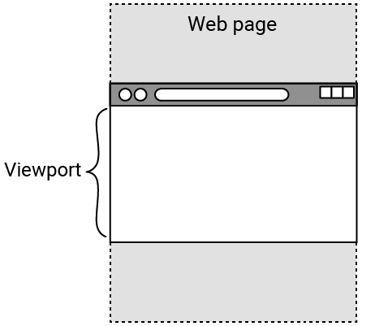

## 添加首页横幅图像

在你的网页顶部放置一些精美的图片，向所有人展示其内容！

<iframe src="https://editor.raspberrypi.org/zh-CN/embed/viewer/welcome-to-antarctica-step4" width="100%" height="800" frameborder="0" marginwidth="0" marginheight="0" allowfullscreen> </iframe>

### 在标题中添加首页横幅图像

页面顶部的大型全宽图像称为**首页横幅图像**。

--- task ---

向 `<header>` 添加新的 `
` 元素。

为新的 `
` 赋予 `hero-image` 类属性。

--- code ---
---
language: html
filename: index.html
line_numbers: true
line_number_start: 11
line_highlights: 19
---

    <header>
      <nav>
        

          <a href="index.html" class="active">主页</a>
          <a href="wildlife.html">野生动物</a>
          <a href="climate.html">气候</a>
        

      </nav>
      

    </header>

--- /code ---

--- /task ---

--- task ---

在 `style.css` 中，为 `hero-image` 类添加一个新的选择器。

你无需向 HTML 添加 `` 元素，而是可以使用 CSS `background-image` 属性来添加图像。

图像应填充 `
` 元素（通过将 `background-size` 属性设置为 `cover`）并居中。

--- code ---
---
language: css
filename: style.css
line_numbers: true
line_number_start: 73
line_highlights: 74-79
---

/* 首页横幅图像 - 主页 */
.hero-image {
  min-height: 50vh; /* 页面可见区域的 50% */
  background-image: url('antarctic-lights.jpg');
  background-size: cover;
  background-position: center;
}

--- /code ---

--- collapse ---

---
title: 在 CSS 中使用 vh 和 vw
---

当使用 CSS 设置元素的大小时，你可能希望高度或宽度根据所查看的屏幕的大小而变化。

网页的可见区域称为**视口**，并且不同设备之间的可见区域会有所不同：例如，手机屏幕与笔记本电脑屏幕的尺寸有很大不同。

在 CSS 中，你可以使用 `vh` 来设置元素相对于视口**高度**的大小。 你在其前面输入的数字是元素应占用的视口高度的**百分比**。 因此 `50vh` 是视口高度的**一半**。

`vw` 对于视口的**宽度** 以相同的方式工作。

--- /collapse ---

--- /task ---

--- task ---

**点击运行**

--- /task ---

### 复制标题

`index.html` 看起来很棒！ 是时候将页眉添加到其他页面了。

--- task ---

突出显示并复制（Ctrl + C 或 Cmd + C）`index.html` 中 `<header>` 部分的内容。

--- code ---
---
language: html
filename: index.html
line_numbers: true
line_number_start: 12
---
      <nav>
        

          <a href="index.html" class="active">主页</a>
          <a href="wildlife.html">野生动物</a>
          <a href="climate.html">气候</a>
        

      </nav>
      

--- /code ---

--- /task ---

--- task ---

打开 `wildlife.html` 文件。

将内容粘贴到 `<header>` 中并更改具有活动类的链接。

--- code ---
---
language: html
filename: wildlife.html
line_numbers: true
line_number_start: 11
line_highlights: 12-19
---
    <header>
      <nav class="navigation-header">
        

          <a href="index.html">主页</a>
          <a href="wildlife.html" class="active">野生动物</a>
          <a href="climate.html">气候</a>
        

      </nav>
      

    </header>

--- /code ---

--- /task ---

--- task ---

**点击运行**

--- collapse ---

---
title: 首页链接还是白色的？
---

检查 `index.html` 链接是否已删除活动，以及 `wildlife.html` 是否已添加活动。

--- /collapse ---

--- /task ---

--- task ---

再次突出显示并复制（Ctrl + C 或 Cmd + C）`index.html` 中 `<header>` 部分的内容。

--- /task ---

--- task ---

将 `<header>` 内容粘贴到 `climate.html` 中并更改具有活动类的链接。

--- code ---
---
language: html
filename: climate.html
line_numbers: true
line_number_start: 11
line_highlights: 12-19
---
    <header>
      <nav class="navigation-header">
        

          <a href="index.html">主页</a>
          <a href="wildlife.html">野生动物</a>
          <a href="climate.html" class="active">气候</a>
        

      </nav>
      

    </header>

--- /code ---

--- /task ---

--- task ---

**点击运行**

--- collapse ---

---
title: 我的首页链接还是白色的？
---

检查 `index.html` 链接是否已删除，以及 `climate.html` 是否已添加。

--- /collapse ---

--- /task ---

### 设置 Wildlife 页面的页眉样式

每个页面都应该有自己的首页横幅图像来代表其内容！

--- task ---

在 `style.css` 中为野生动物添加一个新的类选择器。

你可以设置一个新的 `background-image` 属性，它将覆盖 `hero-image` 类中设置的属性。

--- code ---
---
language: css
filename: style.css
line_numbers: true
line_number_start: 81
line_highlights: 82-84
---
/* 首页横幅图像 - 野生动物 */
.wildlife {
  background-image: url('antarctic-penguins.jpg');
}

--- /code ---

--- /task ---

--- task ---

现在将新的 `wildlife` 类作为 **附加** 应用于 `wildlife.html` 中的 `hero-image` 类。

--- code ---
---
language: html
filename: wildlife.html
line_numbers: true
line_number_start: 18
line_highlights: 19
---
      </nav>
      

--- /code ---

--- /task ---

--- task ---

**点击运行**

--- collapse ---

---
title: 我的英雄形象消失了？
---

确保 `hero-image` 和 `wildlife` 类之间有空格。

--- /collapse ---

--- /task ---

### 设置气候页面标题的样式

--- task ---

在 `style.css` 中，为气候添加另一个新的类选择器。

--- code ---
---
language: css
filename: style.css
line_numbers: true
line_number_start: 86
line_highlights: 87-89
---
/* 首页横幅图像 - 气候 */
.climate {
  background-image: url('antarctic-daytime.jpg');
}

--- /code ---

--- /task ---

--- task ---

现在将新的 `climate` 类作为 **附加** 应用于 `climate.html` 中的 `hero-image` 类。

--- code ---
---
language: html
filename: climate.html
line_numbers: true
line_number_start: 10
line_highlights: 18
---

      </nav>
      

--- /code ---

--- /task ---

--- task ---

**点击运行**

--- /task ---

接下来，你将通过使用网格排列事物并使用动画添加有趣的动作来使你的网页变得精彩！
